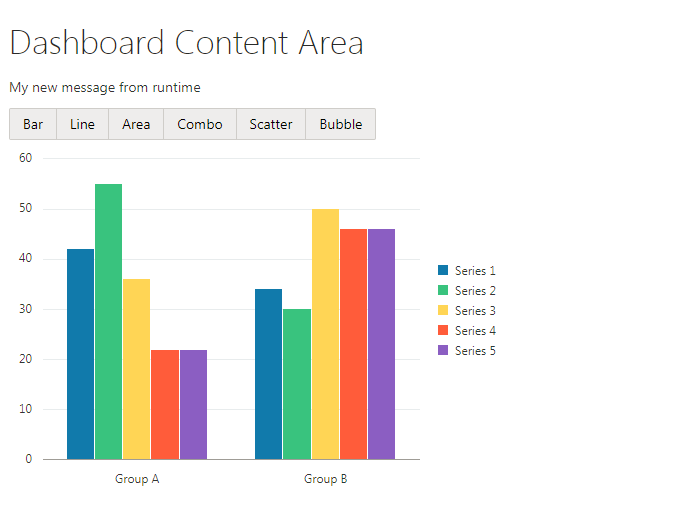

# Beginners  Oracle JET HOL 2018

### Prerequisites
* Please complete the [beginners start HOL](/beginners-start) before attempting this version.
* All pre-reqs defined in the [root of this repository](/README.md) apply to this version as well. 


### Oracle JET Data Binding
The Oracle JET uses Knockout to perform the data binding and provides a one-way and two-way data binding.

Difference between one-way binding and two-way binding:
* one-way - Data changes in the ViewModel are sent to the UI components, and user input from the UI components does not affect the ViewModel.
* two-way - Data changes in the ViewModel are sent to the UI components, and user input from the UI components is written back into the ViewModel.

### Extend the default component
The next thing will be done is extend a chart with type switcher. This is another Oracle JET component called The JET ButtonsetOne.
ButtonsetOne can be used to group related buttons, where only one button may be selected at the same time.

First step is adding data to _src/js/jet-composites/my-chart/my-chart-viewModel.js_ inside of the _ExampleComponentModel_ function

```javascript
self.chartTypes = [
    {id: 'bar',  label: 'Bar'},
    {id: 'line', label: 'Line'},
    {id: 'area', label: 'Area'},
    {id: 'combo', label: 'Combo'},
    {id: 'scatter', label: 'Scatter'},
    {id: 'bubble', label: 'Bubble'}
];
``` 
Since the variable chartTypes declared as 'class field' it will be available in the view.
Put the following code into _my-chart-view.html_ before `<oj-chart />` component.

```html
<oj-buttonset-one class="chartType">
    <!-- ko foreach: chartTypes -->
        <oj-option value='[[id]]'>
            <span data-bind="text: label"></span>
        </oj-option>
    <!-- /ko -->
</oj-buttonset-one>
```

As we remember from previous lesson, we need to add a reference to the JET Chart UI component so that our module will know to load it.
In this case we use `<oj-buttonset-one />` component. Simply update `define` section on _src/js/jet-composites/my-chart/my-chart-viewModel.js_

 ```javascript
define(
    ['ojs/ojcore', 'knockout', 'jquery', 'ojL10n!./resources/nls/my-chart-strings', 'ojs/ojchart', 'ojs/ojbutton'], function (oj, ko, $) {
```



**IMAGE 1**

Here you can see the horizontal list decorated as buttons. But no button is selected. You can select any button manually but this doesn't affect anything in view-model.
This means we have no bindings yet except list elements. Let's update component `my-chart` to select first button from buttonset.

Changes in `src/js/jet-composites/my-chart/my-chart-viewModel.js`
```javascript
// The variable can be setted from context properties or 'bar' by default
self.chartType = ko.observable(context.properties.chartType || 'bar');
```

Changes in `src/js/jet-composites/my-chart/my-chart-view.html`
```html
<oj-buttonset-one class="chartType" value="[[chartType]]">
...
<oj-chart id="barChart"
      type="[[chartType]]"
...
```

After this changes the button labeled 'Bar' will be active and the component `<oj-chart />` will have type 'bar'.
Note that any clicks on the `<oj-buttonset-one />` component have no effect.

### Add interaction between button sets and chart
In previous section, we used double square brackets to bind value from view-model to view. This is one-way data binding.
If we need two-way data binding we need to use double braces instead brackets.
Simply, replace brackets with braces in `src/js/jet-composites/my-chart/my-chart-view.html`
```html
<oj-buttonset-one class="chartType" value="{{chartType}}">
```

Let's try to click on component `<oj-buttonset-one />`. The chart automatically changes its  type.


**IMAGE 2**

This example demonstrates how data bindings are works and the easiest way to make the interaction between different components.

***
## Learn more about Oracle JET
To learn more about Oracle JET, resources such as an online training course, and other example applications are available from the **Learn** page of the [JET website](http://oraclejet.org "oracle jet home page")
